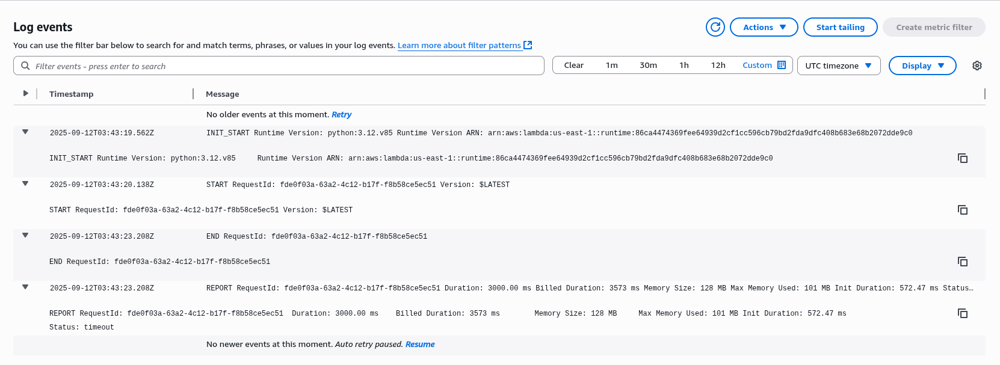

## Criar uma função Lambda

1. Criar dois buckets no S3: um com um nome qualquer e o segundo o o mesmo nome, mas com um sufixo com resized (ex: neves e neves-resized)
2. Entrar no serviço Lambda pela console AWS
3. Criar uma função lambda usando a opção "Author from scratch", definir um nome para função
e escolher o "role" existente chamado LabRole
6. Na próxima página, use as seguintes opções na seção Runtime Settings:

   - Runtime: Python 3.12
   - Handler: lambda_function.lambda_handler

7. Fazer upload do arquivo [lambda_function.zip](https://github.com/tecmx/mx-aws-labs/raw/refs/heads/main/lambda_function.zip). (Obs: esse arquivo foi criado seguindo o [tutorial](https://docs.aws.amazon.com/lambda/latest/dg/with-s3-tutorial.html#with-s3-tutorial-create-function-package) da Amazon. Se alguém se interessar em aprender como gerar esse arquivo, basta reproduzir os passos da secão Python até o final).

8. Ir na seção trigger e configurar o lançamento da função a cada evento de criação de objeto no S3 (All object create events) no bucket criado no passo 1 (usar o bucket sem o sufixo -resized).

9. Testar: fazer upload de uma imagem para o primeiro bucket, logo após verificar o conteúdo do bucket com sufixo -resized. Você também pode realizar este teste usando o servidor de upload executado nos passos anteriores. O comportamento esperado é que uma arquivo de tamanho menor (thumbnail) tenha sido criado no bucket com sufixo -resized.

Caso o thumbnail não tenha sido criado, consultar os logs gerados pela função lambda junto ao serviço [CloudWatch](https://console.aws.amazon.com/cloudwatch/home?region=us-east-1#logsV2:log-groups) para identificar o problema.

Ele pode demorar até um pouco mais de 2 minutos para refletir no "bucket-resized".

Segue exemplo do log, caso bem-sucedido:

